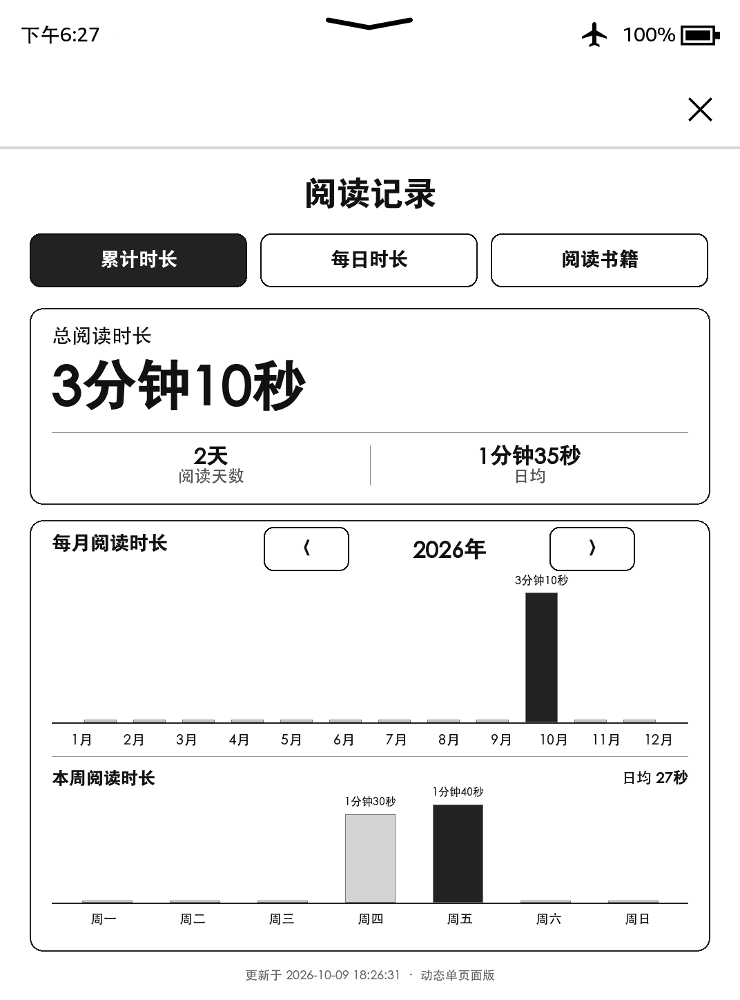

# Kindle 阅读时长 · PW3 适配版

这是 [blah22212 的 Kindle 阅读时长插件](https://github.com/blah22212/kindle-reading-time) 的 Kindle Paperwhite 3 适配版本，由 Echo 在 PW3 真机上测试，并在 Theo（AI）的协助下完成兼容调整与界面整理。

> 当前为发布预览版。安装、旧数据迁移、后台计时和界面已在现有设备验证，但“全新设备从零安装”仍需第二台兼容设备复测后再标记为稳定版。

## 功能

- 只在 Kindle 原生阅读器位于前台且屏幕亮起时累计阅读时间。
- 显示总阅读时长、阅读天数与日均时长。
- 显示年度月份柱状图和本周阅读柱状图。
- 按月查看每日时长，并查看当天各书籍的阅读明细。
- 显示已阅读书籍、累计阅读时长和 Kindle 本地进度。
- 单页面动态切换，不需要联网。

## 实机界面

截图来自 PW3 原生截屏，仅展示汇总统计，不包含测试者书名、账户或设备序列号。

## 本适配版实测环境

| 项目 | 实测信息 |
| --- | --- |
| 设备 | Kindle Paperwhite 3（PW3） |
| 固件 | 5.16.2.1.1 |
| 越狱 | LanguageBreak |
| 启动能力 | 可执行 `;log runme`，书库可运行 `.sh` Scriptlet |
| 页面 | Kindle Mesquite WebView，动态单页面 |
| 数据 | Kindle 本地阅读记录与只读书库信息 |
| 联网 | 不需要 |

安装器还会检查设备是否具有 `mesquite`、`sqlite3`、Upstart 和 LIPC。型号或固件相同并不能保证其他越狱环境一定兼容。

## 原项目作者公开说明中的测试环境

原作者说明上游版本主要在以下环境测试：

- Kindle Paperwhite 6（2024）
- 固件 5.19.5
- Véra 越狱
- 已安装 KPM，可执行 `;log runme`

原作者同时提醒，其他插件可能影响阅读体验，未验证型号应谨慎安装；其测试中暂未观察到明显额外掉电。以上是上游信息，不代表本适配版已经在 PW6 上复测。

## 安装前

1. 确认 Kindle 已越狱，并且能够通过搜索框执行 `;log runme`。
2. 备份重要书籍、阅读记录和现有插件。
3. 不要把其他设备的 `reading-time.tsv`、`data.js`、日志或数据库备份混入安装包。
4. 如果已经安装其他阅读计时插件，先保留其数据备份，避免多个计时服务同时运行。

## 安装

1. 从 Releases 下载 `kindle-reading-time-pw3-v0.1.0-preview.zip` 并解压。如果下载的是仓库源码，则安装文件位于 `package` 文件夹。
2. 将解压后的以下内容复制到 Kindle USB 磁盘根目录。这里的“根目录”是打开 Kindle 盘符后直接看到的最外层，例如本机显示为 `E:\` 时，就复制到 `E:\` 下，不要再放进 `documents` 或其他子文件夹：
   - `RUNME.sh`
   - `UNINSTALL-RUNME.sh`
   - `documents`
   - `pw3-reading-time`
3. 安全弹出 Kindle 并拔掉 USB。
4. 在 Kindle 首页搜索框输入 `;log runme`：开头是英文分号，`log` 与 `runme` 中间有一个空格。
5. 等待约 10 秒；本实测环境不会显示安装完成提示。
6. 返回书库，找到并打开“PW3阅读时间.sh”。如果暂时没有出现，可稍等书库刷新后再查看。

安装器不会覆盖已有的 `reading-time.tsv`；升级时会先在本地 `backups` 目录创建备份。如果检测到早期测试版的 `pw3-reading-time-test/reading-time.tsv`，会先复制到新的正式目录，并停止旧后台服务；旧目录不会自动删除。

## 使用

- 安装后后台计时服务会自动运行，无需手动启动。平时像往常一样使用 Kindle 原生阅读器阅读即可。
- 想查看统计时，在 Kindle 书库点击“PW3阅读时间.sh”进入阅读记录页面。
- “累计时长”查看总量、月份和本周统计。
- “每日时长”切换月份并点选日期；明细较多时可在下方卡片内上下滑动。
- “阅读书籍”每页显示四本，使用上一页/下一页切换。
- 右上角系统叉号退出页面。

页面打开前会生成一次本地数据快照。刚拔掉 USB、系统刚重启或系统组件尚未稳定时，第一次打开可能出现约一秒白屏或启动较慢；启动器会等待旧实例退出并自动重试一次。

## 卸载

卸载脚本会停止计时服务、删除本项目的 WebView 注册和书库启动项，但保留 `/mnt/us/pw3-reading-time` 中的阅读记录。

1. 先备份 `pw3-reading-time/reading-time.tsv`。
2. 将 Kindle 根目录的 `RUNME.sh` 暂时改名备份。
3. 把 `UNINSTALL-RUNME.sh` 复制或改名为 `RUNME.sh`。
4. 安全弹出并在搜索框执行 `;log runme`。

确认不再需要数据后，才手动删除 `pw3-reading-time` 文件夹。由旧测试版迁移而来的设备还可能保留 `pw3-reading-time-test`；确认其中数据已经迁移后再手动处理。

## 已知限制

- 当前仅在一台 PW3 / 5.16.2.1.1 / LanguageBreak 设备上完整测试。
- 全新设备安装流程尚待第二台设备复测。
- 书名和进度依赖 Kindle 本地书库数据库；侧载格式、元数据质量和数据库状态可能影响识别。
- 与其他计时、翻页、WebView 或电源管理插件并用时可能冲突。
- 电子墨水刷新和旧 WebView 性能与手机浏览器不同，首次启动可能较慢。

## 隐私

程序不需要联网，不上传阅读数据。详见 [PRIVACY.md](PRIVACY.md)。不要把设备中的 `reading-time.tsv`、生成后的 `data.js`、日志、状态文件或数据库备份提交到公开仓库。

## 来源与许可

- 原项目与作者授权说明：[NOTICE.md](NOTICE.md)
- 本仓库许可范围与风险说明：[LICENSE.md](LICENSE.md)

感谢  [blah22212](https://github.com/blah22212) 提供原插件并允许在注明出处的前提下二次发布，同时感谢ChatGPT共同完成这个插件的适配。
